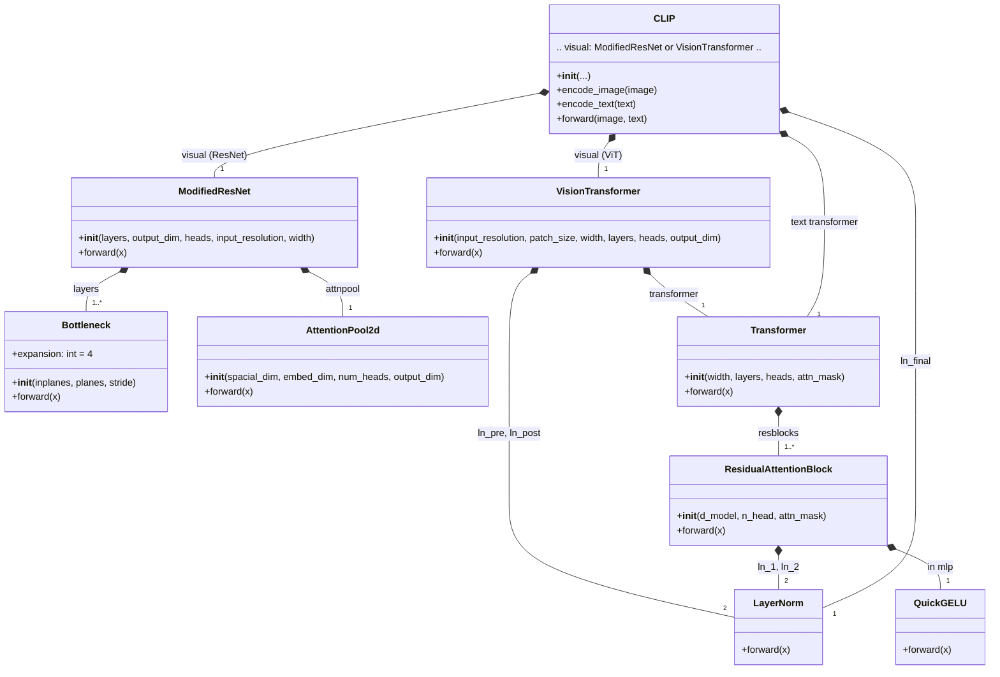

# :rocket:Model Introduction:rocket:

## :house:1.CLIP_Origin Architecture:house:

When constructing the CLIP model, the code manually builds the dependency relationships of each component through a layered and modular design: first, basic components such as Bottleneck (for ModifiedResNet), AttentionPool2d (implementing attention pooling), and ResidualAttentionBlock (the basic unit of Transformer) are defined. Then, based on these, two types of visual encoders are constructed respectively: ModifiedResNet (suitable for the CNN backbone) and VisionTransformer (suitable for the ViT backbone). At the same time, a Transformer encoder for the text side is built, and both are uniformly integrated into the main CLIP class. CLIP automatically selects the visual backbone according to the type of vision\_layers, aligns the image and text feature spaces through the shared embed\_dim, and adjusts the similarity output using the learnable logit\_scale. The entire dependency chain is bottom-up, from underlying convolution/attention operations to high-level multimodal alignment logic, with layers of encapsulation and parameter collaboration, ultimately forming an end-to-end contrastive learning architecture. The specific code can be viewed in detail in [clip.py](dl_exam/vlm/clip_origin/model.py), and this code refers to and learns from the [CLIP](https://github.com/openai/CLIP.git) repository.

## :house:2.CLIP_Latest Architecture:house:

