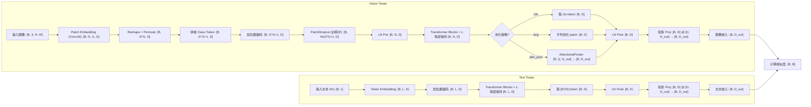

# :rocket:Model Introduction:rocket:

Vision-Language Models (VLMs), as the core carrier of multimodal artificial intelligence, have made significant breakthroughs in recent years in terms of architectural design, training paradigms, and application scenarios. Modern VLMs are based on Transformers as their backbone, establishing a cross-modal semantic foundation through large-scale image-text alignment pre-training (such as CLIP and ALIGN), and have gradually evolved into general multimodal bases that support fine-grained understanding, generation, and reasoning. Current mainstream VLM architectures generally adopt a "two-tower" or "fusion encoder" structure. During the pre-training phase, they combine contrastive learning, mask modeling, and generative objectives to achieve deep alignment between images and text. In the post-alignment phase, they enhance the model's generalization and controllability in open-world tasks through instruction tuning, reinforcement learning from human feedback (RLHF), and domain adaptation strategies. Cutting-edge VLMs not only support traditional tasks such as image-text retrieval, Visual Question Answering (VQA), and image captioning but also demonstrate strong zero-shot transfer capabilities, multi-step reasoning abilities (such as Chain-of-Thought in VLM), as well as the potential for tool invocation and interaction with external knowledge. Representative models include: BLIP/BLIP-2 (efficient modular design), Flamingo (few-shot learning based on frozen pre-trained models), KOSMOS-1/2 (unified multimodal sequence modeling), LLaVA/LLaVA-NeXT (open-source multimodal dialogue agents), Qwen-VL/Qwen2-VL (supporting high-resolution and complex layout understanding), IDEFICS2 (open science-oriented multilingual VLM), as well as closed-source system-level models such as Google’s PaLI-X, Gemini series, and OpenAI’s GPT-4V(ision).

## :house:1.CLIP Architecture:house:

The construction process of [MultimodalTransformer](https://github.com/Rtwotwo/Code-Exam/blob/main/dl_exam/vlm/clip_latest/transformer.py) takes the standard Transformer encoder as its core framework, and realizes cross-modal interaction through multi-layer stacked ResidualAttentionBlocks. Each ResidualAttentionBlock contains a custom Attention module (supporting cross-attention mechanism for fusing image and text features), a feed-forward network MLP driven by the [QuickGELU](https://github.com/Rtwotwo/Code-Exam/blob/main/dl_exam/base/utils/activation.py) activation function, and an optional high-precision normalization layer LayerNormFp32 to stabilize the training process. The entire Transformer body is encapsulated in the MultimodalTransformer class, which is responsible for receiving embedding sequences from the visual encoder and text encoder. Under the iterative action of multi-layer residual attention blocks, it gradually aligns and fuses the semantic information of the two modalities, and finally outputs a joint multimodal representation, thereby realizing the modeling of deep semantic association between images and texts. And thanks the [open_clip's](https://github.com/mlfoundations/open_clip.git) open source code.

```mermaid
flowchart LR
    A["原始文本\n(str 或 List[str])"]
    --> B["清洗文本\n(clean_fn: lower/whitespace/canonicalize)\n→ str"]
    --> C["正则分词\nre.findall(pat, text)\n→ List[str]"]
    --> D["UTF-8 编码 → 字节\n.encode('utf-8')\n→ List[int] (0~255)"]
    --> E["字节 → 可打印 Unicode\nbyte_encoder[b]\n→ str"]
    --> F["BPE 子词分割\nbpe(token)\n→ 'sub1 sub2 ...</w>'"]
    --> G["Token → ID\nencoder[subword]\n→ List[int] (len=N)"]
    --> H["添加特殊标记\n[SOT] + ids + [EOT]\n→ len=N+2"]
    --> I["截断/填充至 77\n(末尾强制为 EOT)\n→ List[int] (len≤77)"]
    --> J["输出 LongTensor\n→ torch.LongTensor\nShape: [batch_size, 77]"]
```

