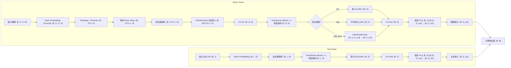
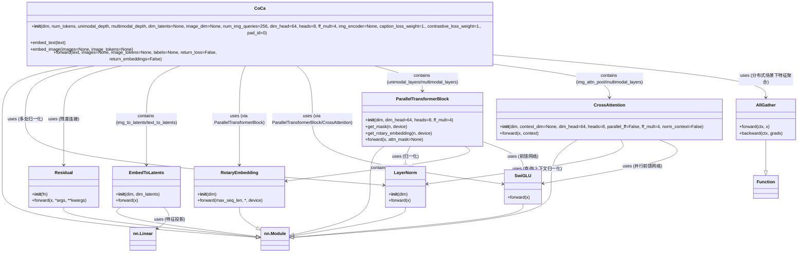

# :rocket:Model Introduction:rocket:

Vision-Language Models (VLMs), as the core carrier of multimodal artificial intelligence, have made significant breakthroughs in recent years in terms of architectural design, training paradigms, and application scenarios. Modern VLMs are based on Transformers as their backbone, establishing a cross-modal semantic foundation through large-scale image-text alignment pre-training (such as CLIP and ALIGN), and have gradually evolved into general multimodal bases that support fine-grained understanding, generation, and reasoning. Current mainstream VLM architectures generally adopt a "two-tower" or "fusion encoder" structure. During the pre-training phase, they combine contrastive learning, mask modeling, and generative objectives to achieve deep alignment between images and text. In the post-alignment phase, they enhance the model's generalization and controllability in open-world tasks through instruction tuning, reinforcement learning from human feedback (RLHF), and domain adaptation strategies. Cutting-edge VLMs not only support traditional tasks such as image-text retrieval, Visual Question Answering (VQA), and image captioning but also demonstrate strong zero-shot transfer capabilities, multi-step reasoning abilities (such as Chain-of-Thought in VLM), as well as the potential for tool invocation and interaction with external knowledge. Representative models include: BLIP/BLIP-2 (efficient modular design), Flamingo (few-shot learning based on frozen pre-trained models), KOSMOS-1/2 (unified multimodal sequence modeling), LLaVA/LLaVA-NeXT (open-source multimodal dialogue agents), Qwen-VL/Qwen2-VL (supporting high-resolution and complex layout understanding), IDEFICS2 (open science-oriented multilingual VLM), as well as closed-source system-level models such as Google’s PaLI-X, Gemini series, and OpenAI’s GPT-4V(ision).

## :house:1.CLIP_Origin Architecture:house:

When constructing the CLIP model, the code manually builds the dependency relationships of each component through a layered and modular design: first, basic components such as Bottleneck (for ModifiedResNet), AttentionPool2d (implementing attention pooling), and ResidualAttentionBlock (the basic unit of Transformer) are defined. Then, based on these, two types of visual encoders are constructed respectively: ModifiedResNet (suitable for the CNN backbone) and VisionTransformer (suitable for the ViT backbone). At the same time, a Transformer encoder for the text side is built, and both are uniformly integrated into the main CLIP class. CLIP automatically selects the visual backbone according to the type of vision\_layers, aligns the image and text feature spaces through the shared embed\_dim, and adjusts the similarity output using the learnable logit\_scale. The entire dependency chain is bottom-up, from underlying convolution/attention operations to high-level multimodal alignment logic, with layers of encapsulation and parameter collaboration, ultimately forming an end-to-end contrastive learning architecture. The specific code can be viewed in detail in [clip.py](https://github.com/Rtwotwo/Code-Exam/blob/main/dl_exam/vlm/clip_origin/clip.py), and this code refers to and learns from the [CLIP](https://github.com/openai/CLIP.git) repository.

```mermaid
flowchart LR
    subgraph Image Tower [Vision Transformer]
        A["Input Image\n[B, 3, 224, 224]"] --> B["Patch Embedding\n(Conv2d, patch=16)\n→ [B, 768, 14, 14]"]
        B --> C["Reshape → [B, 768, 196]"]
        C --> D["Permute → [B, 196, 768]"]
        D --> E["Add Class Token\n→ [B, 197, 768]"]
        E --> F["Add Pos Emb\n→ [B, 197, 768]"]
        F --> G["LN Pre\n→ [B, 197, 768]"]
        G --> H["Transformer ×12\n→ [B, 197, 768]"]
        H --> I["Take cls token\nx[:, 0] → [B, 768]"]
        I --> J["LN Post → [B, 768]"]
        J --> K["Projection @ [768,512]\n→ [B, 512]"]
    end

    subgraph Text Tower [Text Transformer]
        P["Input Tokens\n[B, 77]"] --> Q["Token Embedding\n→ [B, 77, 512]"]
        Q --> R["Add Pos Emb\n→ [B, 77, 512]"]
        R --> S["Permute → [77, B, 512]"]
        S --> T["Transformer ×12\n→ [77, B, 512]"]
        T --> U["Permute back → [B, 77, 512]"]
        U --> V["LN Final → [B, 77, 512]"]
        V --> W["Gather EOS token\n(text.argmax) → [B, 512]"]
        W --> X["Projection @ [512,512]\n→ [B, 512]"]
    end

    K --> Y["L2 Normalize\n→ [B, 512]"]
    X --> Z["L2 Normalize\n→ [B, 512]"]
    Y --> AA["Similarity:\nscale · I @ Tᵀ\n→ [B, B]"]
    Z --> AA
    AA --> BB["logits_per_image &\nlogits_per_text"]
```

## :house:2.CLIP_Latest Architecture:house:

The construction process of [MultimodalTransformer](https://github.com/Rtwotwo/Code-Exam/blob/main/dl_exam/vlm/clip_latest/transformer.py) takes the standard Transformer encoder as its core framework, and realizes cross-modal interaction through multi-layer stacked ResidualAttentionBlocks. Each ResidualAttentionBlock contains a custom Attention module (supporting cross-attention mechanism for fusing image and text features), a feed-forward network MLP driven by the [QuickGELU](https://github.com/Rtwotwo/Code-Exam/blob/main/dl_exam/base/utils/activation.py) activation function, and an optional high-precision normalization layer LayerNormFp32 to stabilize the training process. The entire Transformer body is encapsulated in the MultimodalTransformer class, which is responsible for receiving embedding sequences from the visual encoder and text encoder. Under the iterative action of multi-layer residual attention blocks, it gradually aligns and fuses the semantic information of the two modalities, and finally outputs a joint multimodal representation, thereby realizing the modeling of deep semantic association between images and texts. And thanks the [open_clip's](https://github.com/mlfoundations/open_clip.git) open source code.

```mermaid
classDiagram
    direction TB
    
    %% 基础组件层
    class LayerNormFp32 {
        +forward(x:torch.Tensor) torch.Tensor
    }
    class LayerNorm {
        +forward(x:torch.Tensor) torch.Tensor
    }
    class QuickGELU {
        +forward(x:torch.Tensor) torch.Tensor
    }
    class LayerScale {
        +__init__(dim:int, init_values:float, inplace:bool)
        +forward(x:torch.Tensor) torch.Tensor
    }
    class PatchDropout {
        +__init__(prob:float, exclude_first_token:bool)
        +forward(x:torch.Tensor) torch.Tensor
    }
    
    %% 注意力核心层
    class Attention {
        +__init__(dim:int, num_heads:int, qkv_bias:bool, ...)
        +forward(x:torch.Tensor, attn_mask:Optional[torch.Tensor]) torch.Tensor
    }
    class AttentionalPooler {
        +__init__(d_model:int, context_dim:int, n_head:int, ...)
        +forward(x:torch.Tensor) torch.Tensor
    }
    class ResidualAttentionBlock {
        +__init__(d_model:int, n_head:int, mlp_ratio:float, ...)
        +attention(q_x:torch.Tensor, k_x:Optional[torch.Tensor], ...) torch.Tensor
        +forward(q_x:torch.Tensor, k_x:Optional[torch.Tensor], ...) torch.Tensor
    }
    class CustomResidualAttentionBlock {
        +__init__(d_model:int, n_head:int, mlp_ratio:float, ...)
        +forward(x:torch.Tensor, attn_mask:Optional[torch.Tensor]) torch.Tensor
    }
    
    %% Transformer 封装层
    class CustomTransformer {
        +__init__(width:int, layers:int, heads:int, ...)
        +forward(x:torch.Tensor, attn_mask:Optional[torch.Tensor]) torch.Tensor
    }
    class Transformer {
        +__init__(width:int, layers:int, heads:int, ...)
        +forward(x:torch.Tensor, attn_mask:Optional[torch.Tensor]) torch.Tensor
    }
    
    %% 多模态核心层（VisionTransformer 是 CLIP/多模态的视觉塔）
    class VisionTransformer {
        +__init__(image_size:int, patch_size:int, width:int, ...)
        +forward(x:torch.Tensor) torch.Tensor
        +_embeds(x:torch.Tensor) torch.Tensor
        +_pool(x:torch.Tensor) Tuple[torch.Tensor, torch.Tensor]
    }

    %% 继承/依赖关系
    LayerNormFp32 --|> nn.LayerNorm
    LayerNorm --|> nn.LayerNorm
    QuickGELU --|> nn.Module
    LayerScale --|> nn.Module
    PatchDropout --|> nn.Module
    Attention --|> nn.Module
    AttentionalPooler --|> nn.Module
    ResidualAttentionBlock --|> nn.Module
    CustomResidualAttentionBlock --|> nn.Module
    CustomTransformer --|> nn.Module
    Transformer --|> nn.Module
    VisionTransformer --|> nn.Module

    %% 组合依赖（A 使用 B）
    ResidualAttentionBlock --> LayerNorm : uses
    ResidualAttentionBlock --> LayerScale : uses
    ResidualAttentionBlock --> nn.MultiheadAttention : uses
    ResidualAttentionBlock --> QuickGELU : uses (act_layer)
    
    CustomResidualAttentionBlock --> LayerNorm : uses
    CustomResidualAttentionBlock --> LayerScale : uses
    CustomResidualAttentionBlock --> Attention : uses
    CustomResidualAttentionBlock --> QuickGELU : uses (act_layer)
    
    CustomTransformer --> CustomResidualAttentionBlock : contains (resblocks)
    Transformer --> ResidualAttentionBlock : contains (resblocks)
    Transformer --> CustomResidualAttentionBlock : contains (resblocks, if block_type=custom)
    
    VisionTransformer --> PatchDropout : uses
    VisionTransformer --> LayerNorm : uses (ln_pre/ln_post)
    VisionTransformer --> Transformer : contains
    VisionTransformer --> AttentionalPooler : uses (if attentional_pool=True)
    VisionTransformer --> LayerScale : uses (via Transformer)
```

## :house: 3.CoCa Architecture :house:

CoCa ([Contrastive Captioners](https://github.com/Rtwotwo/Code-Exam/blob/main/dl_exam/vlm/clip_latest/coca_model.py)) is a multimodal model that integrates contrastive learning with generative image captioning. Its construction is centered on a dual-tower plus decoder architecture of "vision tower + text encoder + text decoder": first, it parses three types of configurations, namely CLIPTextCfg, CLIPVisionCfg, and MultimodalCfg, and respectively constructs the VisionTransformer visual encoder through _build_vision_tower, the CLIP-style text encoder through build_text_tower, and the MultimodalTransformer text decoder through build_text_decoder_tower. At the same time, it initializes parameters such as the temperature coefficient logit_scale for contrastive learning. The core function of this model is to achieve image-text feature alignment through cross-modal contrastive learning, supporting image-text retrieval/matching tasks. Additionally, relying on visual features to drive the text decoder, it completes generative tasks such as image captioning. It possesses both feature discriminability and generativeness, and is suitable for a wide range of downstream multimodal tasks such as visual question answering and multimodal retrieval.

